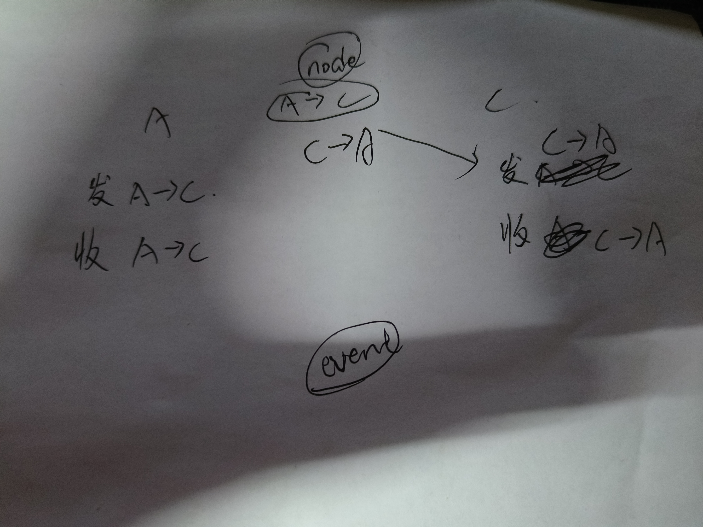

##### less配置
https://blog.csdn.net/weixin_43103088/article/details/88260859

##### node-websocket文件夹为后端接口

注意：
1. setState的数据同步问题

2. 函数组件里的  事件函数定义的问题----里面使用的数据是否有值的问题。

双人聊天：
前端A用户send消息时：对AtoC事件emit，对CtoA事件on， 同时传过去from, to字段好让后端识别
后端on监听AtoC事件， 同时对CtoA事件emit，让C能够监听到CtoA事件，更新聊天记录。
user_A, user_C， to, from

3. 实际应用需要对每个用户绑定唯一的id(用户身份)，后端处理的时候通过id找到用户以及用户之间对应的聊天记录。
3. 主动断开链接socket.disconnect();